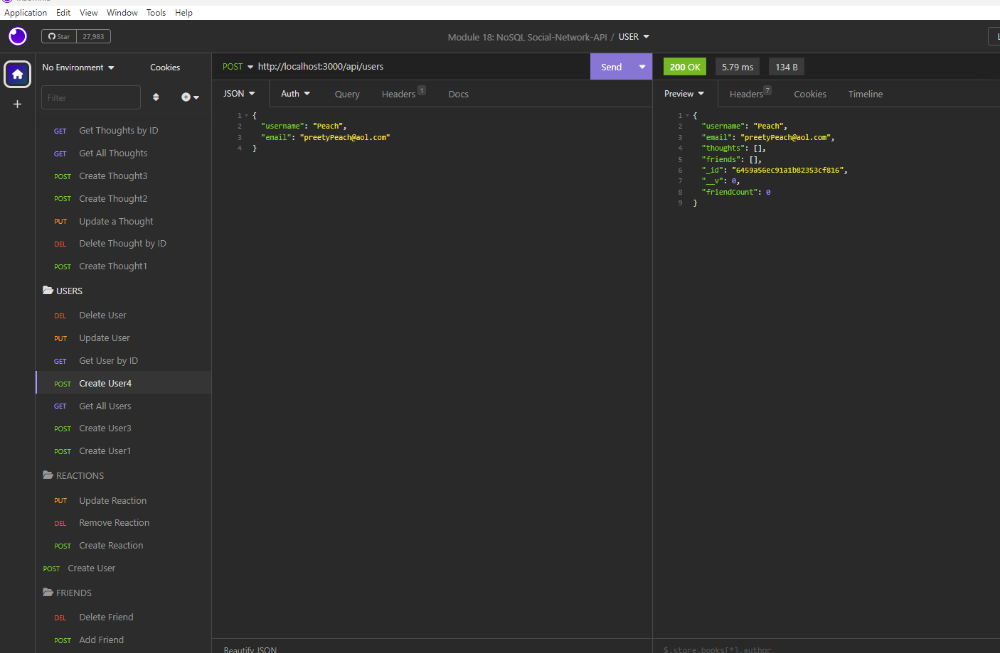
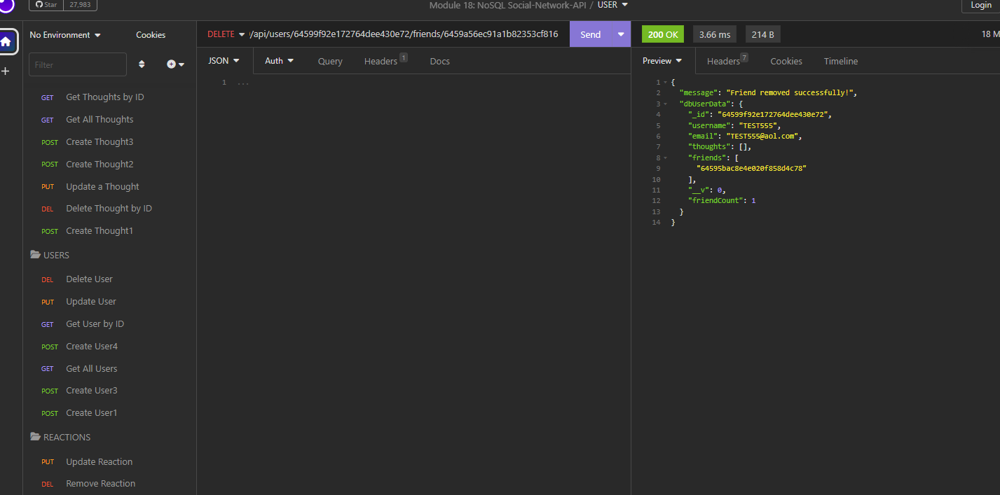

# NoSQL Social-Network-API

## Description:

The noSQL social network API is an application programming interface (API) designed for a social network web application. This app allows users to share their thoughts, react to friends’ thoughts, and create a friend list. The API is built using Node.js and Mongoose, and it provides an easy and scalable way to handle social networking data without restrictions of traditional relational database. 

## Table of Contents


- [Technology](#Technology)
- [Installation](#installation)
- [Usage](#usage)
- [License](#license)
- [Contribution](#contribution)
- [Questions](#questions)


## Technology:
Project is created with:

- Javascript
- Node.js
- Express.js
- MongoDB
- Mongoose
<div style="display: inline_block"><br>
  
 &nbsp;&nbsp;&nbsp;&nbsp;&nbsp;&nbsp;&nbsp;&nbsp;
    
 &nbsp;&nbsp;&nbsp;&nbsp;&nbsp;&nbsp;&nbsp;&nbsp;
  
 &nbsp;&nbsp;&nbsp;&nbsp;&nbsp;&nbsp;&nbsp;&nbsp;
 
 &nbsp;&nbsp;&nbsp;&nbsp;&nbsp;&nbsp;&nbsp;&nbsp;

</div>

</br>


## Installation

To run this project, install it locally using npm:

```
npm install
```

## Usage

After installing npm packages, the application will be invoked by using the following command:

```
node server.js
```

#### Walkthrough Video

[Click me to see the demo video!](https://drive.google.com/file/d/14-_AR94O2kbkJdwXaIHecluUlnd1DSQx/view)

#### Insomnia Screenshot




## License

[](https://opensource.org/licenses/MIT) <br>
This project is licensed under MIT, for more information please visit [this website](https://opensource.org/licenses/MIT)

## Contribution

Made by Wajeeha Riyasat

## Questions?

Please feel free to contact me if you need any further information:

- [Github Profile](https://github.com/WajhR)